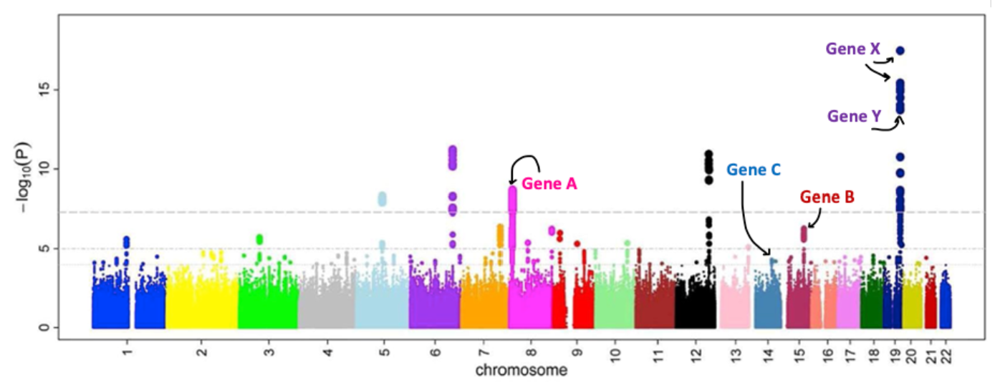

# Background questions

<ol>
   <li>Which of these methods are considered clustering methods?</li>
</ol>
<ol type="a">
        <li>UPGMA</li>
        <li>Complete-linkage hierarchical clustering</li>
        <li>GWAS</li>
        <li>Neighbour-Joining</li>
</ol>

<ol start="2">
    <li>Which of these statements apply to Genome-Wide Association Studies?</li></ol>
<ol type="a">
        <li>Manhattan plots were given this name as a reference to the comic character, Dr. Manhattan</li>
        <li>GWAS is a technique that analyses millions of short tandem repeats distributed across a genome</li>
        <li>GWAS usually performs a large number of statistical analyses, accounting for multiple testing</li>
        <li>GWAS requires large databases of polymorphisms, which can only be achieved in model organisms such as humans</li>
</ol>

The figure below corresponds to a GWAS analysis of genetic variants associated with a neurodegenerative phenotype. SNPs contained within specific genes are labeled. Look at the figure and answer the following questions:

    

<ol start="3">
    <li>Using a significant p-value threshold of 10⁻⁸, this Manhattan plot suggests that...</li></ol>
<ol type="a">
        <li>... various genomic loci may be associated with the phenotype under study</li>
        <li>... gene A may be associated with the phenotype under study</li>
        <li>... genes B and C can be discarded as possible loci associated with the phenotype under study</li>
        <li>... the probability of incorrectly rejecting the null hypothesis (= no association with the phenotype under study) for the marked SNP associated with gene A based on the observed data is larger than 1 in 10⁸.</li>
</ol>

<ol start="4">
    <li>Using a significant p-value threshold of 10⁻⁸, this Manhattan plot suggests that...</li></ol>
<ol type="a">
        <li>a causative SNP for this neurodegenerative disease might be present in gene X</li>
        <li>two causative SNPs for this neurodegenerative disease might be present in gene X</li>
        <li>a causative SNP for this neurodegenerative disease might be present in gene Y</li>
        <li>a causative SNP for this neurodegenerative disease might not be present either in gene X or gene Y, but present in their vicinity</li>
</ol>

[Go to Clustering Exercise](02-Clustering_exercise.md)
